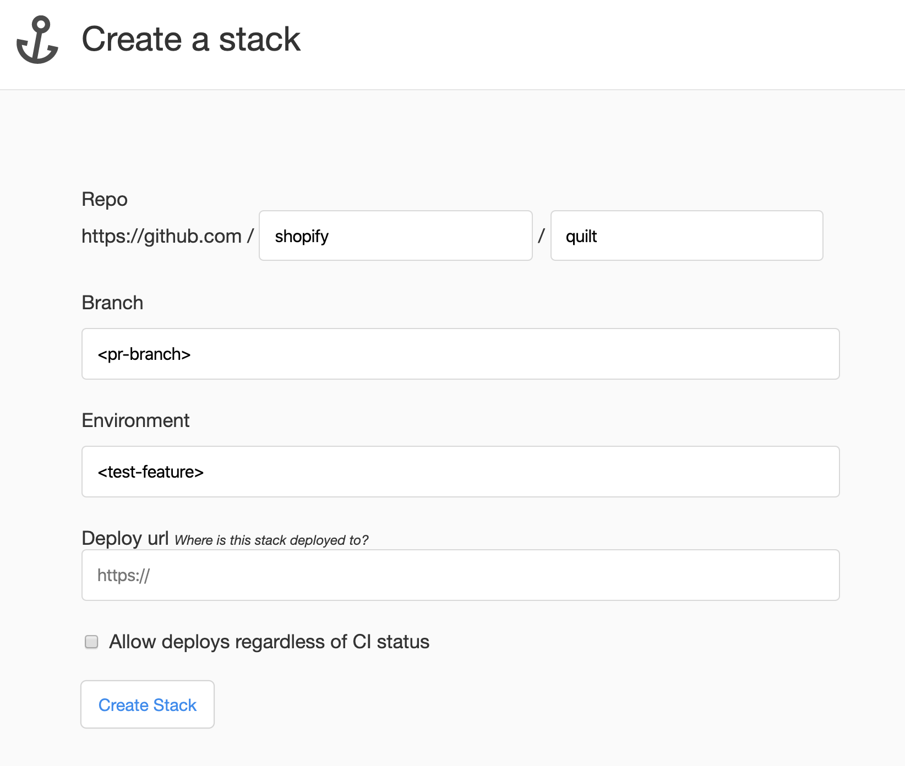

# Creating Releases

**Note🗒️** The following steps require admin access to the Shopify/quilt GitHub repo.

## 1. Preparing local environment

- Ensure you have the latest `main` branch including all tags:

```sh
git checkout main && git pull
```

**Note🗒️** `git pull` should be used instead of `git pull origin main` to ensure that tags are pulled as well.

## 2. Updating `CHANGELOG.md`

- Run `yarn updated` to a get list of packaged that have changed since the last release.
- Go into every package that is being released. Edit `CHANGELOG.md` by moving any line items from `Unreleased` section into a new release with the new section with the new version number and today's date as title. (eg. `1.0.0 - 2019-07-24`).

- Stage the `CHANGELOG.md` changes using:

```sh
git add .
```

**Note🗒️** Lerna will make these staged changes part of the publish commit during the final confirmation of `yarn release`

## 3. Versioning and Tagging

- Begin the release process:

```sh
yarn release
```

- Follow the prompts to choose a version for each package. If you are releasing a new package, we encourage you to version it `1.0.0` to start with.

**Note🗒️** Quilt packages adhere to [Semantic Versioning](http://semver.org/spec/v2.0.0.html).

## 4. Pushing Changes

The following will push the changes and new tags to GitHub:

```sh
git push origin main --follow-tags
```

## 5. Deploying to npm

- Log in to [Shipit](https://shipit.shopify.io/shopify/quilt/production)

- When CI is 🍏 on the commit titled `Publish`, press `Deploy` to update packages on npm.

# Releases for 🎩ing changes?

### Step 1 - Publish a `beta` release for testing

- In your branch, run `yarn run release`. Lerna will launch its CLI to select a version for the changed packages. Select the `Custom` option and enter a version with a `-beta.X` suffix (e.g. `0.29.10-my-feature-beta.1`). Many Quilt packages reference others. If you are prompted to version other packages, it is safe to do so (make sure these are also tagged with `-beta.X`).

  **Note:** Ensure your version includes the `-beta` suffix. This is how [Shipit dictates](https://github.com/Shopify/shipit-engine/blob/master/lib/snippets/publish-lerna-independent-packages#L7-L12) a beta release.

- Push your branch to GitHub with the newly created tags using `git push origin <branch> --follow-tags`
- Create a temporary stack in Shipit that points to your dev branch. Set the Branch to your PR/feature branch and update the Environment to something specific to your feature (e.g. test-cool-feature)
  

- Hit the Deploy button on your Publish commit in Shipit to publish your beta release to npm

### Step 2 - Consume the release

- Add your release to a repository that uses the package you are testing:

```sh
yarn add --dev @shopify/my-package@0.29.10-my-feature-beta.1
```
