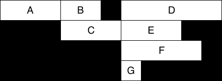
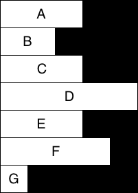

# `@shopify/react-traverse-nodes`

[](https://travis-ci.org/Shopify/quilt)
[](LICENSE.md) [](https://badge.fury.io/js/%40shopify%2Freact-traverse-nodes.svg)

Traverse your ReactNode tree.

## Installation

```bash
$ yarn add @shopify/react-traverse-nodes
```

## Usage

### `traverse()`

Calls a `Visitor` on each node in the provided tree, accumulating any context, and providing an instance of the underlying ReactElement where applicable:

```ts
function visit(
  tree: React.ReactNode,
  visitor: Visitor,
  context: any,
): Promise<void>;
```

A `Visitor` is simply function adhering to the following interface:

```ts
interface Visitor {
  (
    element: React.ReactNode,
    instance: React.ReactInstance | null,
    context: any,
    childContext?: any,
  ): any;
}
```

## Approach

A unique approach is given to cases where a `Visitor` returns a promise:

1. While the promise is resolving, attempt to continue traversal.
2. If the traversal fails, wait for the parent's promise to resolve, then re-attempt traversal of the children.

This leads to an optimal tree traversal, for example, in a data-fetching scenario.

Consider the following example:

Suppose we have the following render dependency tree:

```
      A
    /   \
   B     C
  / \   / \
 D   E F   G
```

Whereby, for example, `B` is rendered by `A` and `F` is rendered by `C`, etc.

Now, suppose that each component is wrapped by a decorator that requires data fetching. The data takes various amounts of time to be fetched, corresponding to the following table:

| Component | Time to fetch data |
| --------- | ------------------ |
| `A`       | `300ms`            |
| `B`       | `200ms`            |
| `C`       | `300ms`            |
| `D`       | `500ms`            |
| `E`       | `300ms`            |
| `F`       | `400ms`            |
| `G`       | `100ms`            |

In a traditional traversal approach, such as the one taken by `react-tree-walker`, this would take a minimum of `1100ms` to complete:



However, using our approach, this could take just `500ms` to complete:


